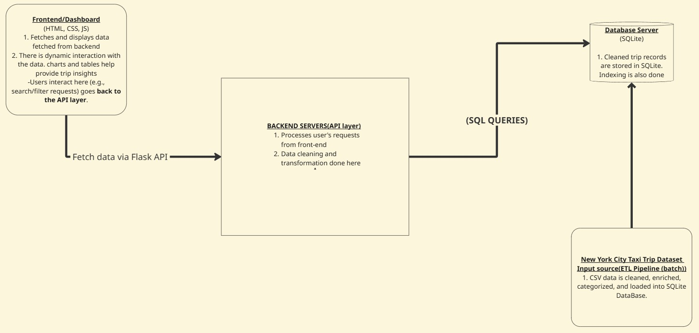
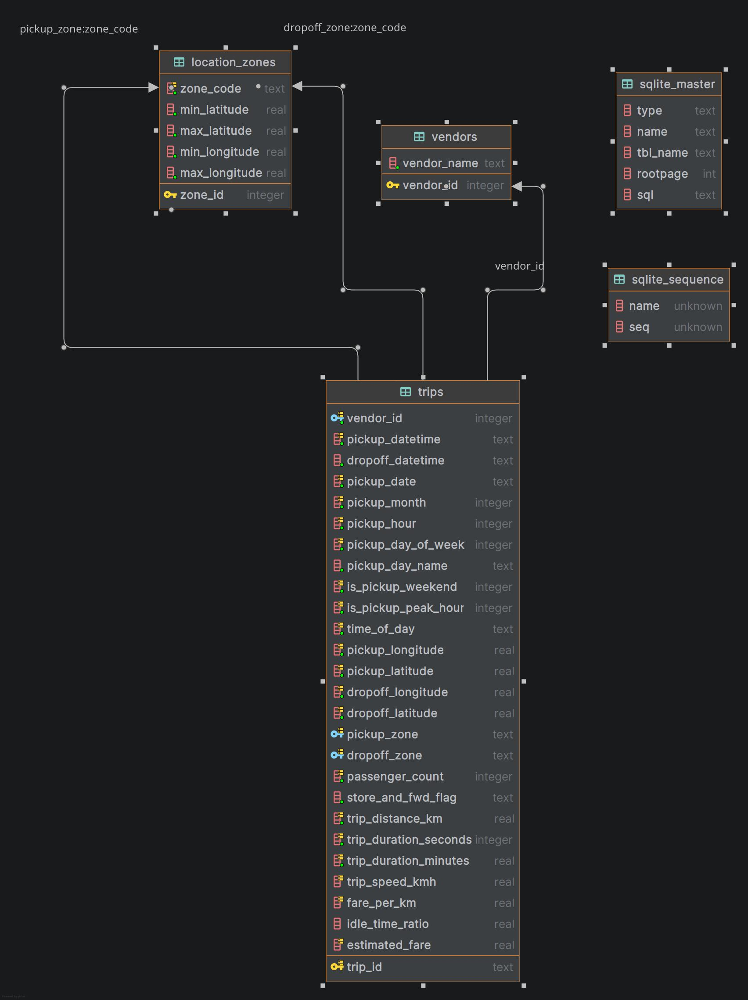

# Urban Mobility Data Explorer

An enterprise-level full-stack application for analyzing and visualizing NYC Taxi Trip data patterns. This project demonstrates data cleaning, database design, backend API development, and interactive frontend visualization.

---

## Table of Contents
- [Overview](#overview)
- [System Architecture](#system-architecture)
- [Database Design](#database-design)
- [Features](#features)
- [Technology Stack](#technology-stack)
- [Installation](#installation)
- [Usage](#usage)
- [API Endpoints](#api-endpoints)
- [Algorithm Implementation](#algorithm-implementation)
- [Deliverables](#deliverables)
- [Team](#team)

---

## Project Structure

```
urban_mobility_data_explorer/
├── backend/
│   ├── app.py                 # Flask API server
│   ├── database/
│   │   ├── db.py              # Database initialization
│   │   ├── schema.sql         # Database schema
│   │   └── nyc_taxi.db        # SQLite database
│   └── logs/
│       └── excluded_records.log
├── data/
│   ├── raw/
│   │   └── train.csv          # Raw dataset
│   └── processed/
│       └── clean_trips.csv    # Cleaned dataset
├── database/
│   └── database_dump.sql      # SQL dump for distribution
├── docs/
│   └── images/
│       ├── entity_relational_diagram.jpg
│       └── system_architecture_design.jpg
├── scripts/
│   └── data_cleaning.py       # Data cleaning pipeline
├── static/
│   ├── script.js              # Frontend logic & algorithm
│   └── styles.css             # Styling
├── templates/
│   └── index.html             # Main dashboard
├── requirements.txt           # Python dependencies
├── setup.py                   # Project setup script
└── run.py                     # Application entry point
```

---

## Overview

The Urban Mobility Data Explorer processes, analyzes, and visualizes over 1.4 million NYC taxi trip records. The system provides interactive insights into urban mobility patterns, helping users understand transportation trends, peak hours, and geographic patterns across New York City.

### Problem Statement
Urban mobility data is complex and difficult to interpret. This application addresses the challenge by:
- Cleaning and validating raw trip data
- Implementing efficient data storage with normalized database design
- Providing intuitive visualizations and filtering capabilities
- Enabling data-driven insights into city transportation patterns

---

## System Architecture

The application follows a three-tier architecture with clear separation of concerns:



### Architecture Components:

1. **Frontend Layer (Presentation)**
   - HTML5/CSS3/JavaScript interface
   - Chart.js for data visualization
   - jQuery for AJAX requests and DOM manipulation
   - Responsive design with dark mode support

2. **Backend Layer (Application)**
   - Flask web framework (Python 3.12)
   - RESTful API endpoints
   - Business logic and data validation
   - CORS support for cross-origin requests

3. **Data Layer (Persistence)**
   - SQLite relational database
   - Normalized schema (3NF)
   - Optimized indexes for query performance
   - Data cleaning pipeline with logging

### Design Decisions:
- **SQLite** chosen for portability and ease of setup (no separate server required)
- **Flask** selected for its simplicity and Python ecosystem integration
- **Client-side rendering** for responsive user experience
- **Normalized schema** to reduce redundancy and improve data integrity

---

## Database Design

Our database follows a normalized relational design with proper indexing for optimal query performance.



### Database Schema:

**Main Tables:**
1. **trips** - Core trip records with timestamps, duration, and location data
2. **vendors** - Taxi vendors (e.g., Creative Mobile Technologies, VeriFone Inc.)
3. **locations** - Pickup/dropoff location zones

**Key Features:**
- Foreign Keys for referential integrity between tables
- Multiple indexes on frequently queried columns (vendor_id, pickup_datetime, passenger_count, etc.)
- 3rd Normal Form (3NF) to eliminate redundancy
- Derived fields for trip_speed, pickup_hour, distance calculations

---

## Features

- Data Processing Pipeline: Automated cleaning and processing of 1.4M+ trip records
- Normalized Database: SQLite database with optimized indexing for efficient queries
- RESTful API: Flask-based backend with multiple filtering endpoints
- Interactive Dashboard: Real-time data visualization with Chart.js
- Advanced Filtering: Filter by vendor, passengers, duration, location, and date
- Responsive Design: Dark mode support and mobile-friendly interface
- Custom Algorithm: Selection sort implementation for data ordering

---

## Technology Stack

### Backend
- Python 3.12+
- Flask 3.0.0 - Web framework
- Flask-CORS 4.0.0 - Cross-origin resource sharing
- SQLite 3 - Relational database
- Pandas 2.1.4 - Data processing
- NumPy 1.26.2 - Numerical computations

### Frontend
- HTML5 - Semantic markup
- CSS3 - Modern styling with CSS variables
- JavaScript (ES6+) - Client-side logic
- Chart.js 4.4.0 - Data visualization
- jQuery 3.7.1 - DOM manipulation and AJAX

---

## Installation

### Prerequisites
- Python 3.12 or higher
- pip (Python package manager)
- Git

### Quick Setup

1. **Clone the repository**
   ```bash
   git clone https://github.com/Masalale/urban_mobility_data_explorer.git
   cd urban_mobility_data_explorer
   ```

2. **Install dependencies**
   ```bash
   pip install -r requirements.txt
   ```

3. **Run setup (processes data and creates database)**
   ```bash
   python setup.py
   ```

This will:
- Clean and process raw data from `data/raw/train.csv`
- Create normalized database at `backend/database/nyc_taxi.db`
- Log excluded records to `backend/logs/excluded_records.log`

### Alternative: Quick Demo with Pre-populated Database

If you want to quickly test the application without processing the full dataset, you can restore from our pre-populated database dump containing 50,000 sample records.

See the [Database README](database/README.md) for instructions on:
- Restoring the database from the SQL dump
- Verifying the database integrity
- Creating new database dumps

This is perfect for demo runs and testing the application functionality.

---

## Usage

### Starting the Application

```bash
python run.py
```

The application will be available at `http://localhost:5000`

### Using the Dashboard

1. **Overview Statistics**: View total trips, average duration, and passenger counts
2. **Filter Data**: Use filters to narrow down trips by:
   - Trip ID search
   - Vendor
   - Passenger count
   - Duration range
   - Month
   - Location
3. **Visualizations**: Interactive charts showing:
   - Trip duration distribution
   - Passenger count distribution
   - Trips by hour of day
   - Geographic pickup locations
4. **Data Table**: Sortable table with all trip details

---

## API Endpoints

| Method | Endpoint                 | Description              | Parameters          |
|--------|--------------------------|--------------------------|---------------------|
| GET    | `/`                      | Serve main dashboard     | -                   |
| GET    | `/api/trips`             | Get first 100 trips      | -                   |
| GET    | `/api/trips/<trip_id>`   | Get specific trip by ID  | `trip_id` (path)    |
| GET    | `/api/trips/by_date`     | Filter trips by date     | `date` (YYYY-MM-DD) |
| GET    | `/api/trips/by_distance` | Filter by distance range | `min`, `max` (km)   |

### Example API Calls

```bash
# Get all trips (limited to 100)
curl http://localhost:5000/api/trips

# Get trip by ID
curl http://localhost:5000/api/trips/id2875421

# Filter by date
curl "http://localhost:5000/api/trips/by_date?date=2016-03-14"

# Filter by distance (2-5 km)
curl "http://localhost:5000/api/trips/by_distance?min=2&max=5"
```

---

## Algorithm Implementation

### Selection Sort Algorithm

As required by the assignment, we implemented a **custom selection sort algorithm** from scratch for sorting trip data in the frontend.

**Location**: `static/script.js`

**Purpose**: Sort trip records by any field (duration, passengers, date, etc.) without using built-in JavaScript sort methods.

**Implementation Details**:

The algorithm sorts an array of trip objects by a specified key and direction:

```javascript
function selectionSort(trips_array, key, direction = 'asc') {
    const trip_arr = [...trips_array];
    const n = trip_arr.length;

    for (let i = 0; i < n - 1; i++) {
        let actualIndex = i;

        for (let j = i + 1; j < n; j++) {
            // Find minimum/maximum element
            let valueA = trip_arr[j][key];
            let valueB = trip_arr[actualIndex][key];

            // Handle different data types (dates, strings, numbers)
            if (valueA instanceof Date) valueA = valueA.getTime();
            if (valueB instanceof Date) valueB = valueB.getTime();
            if (typeof valueA === 'string') valueA = valueA.toLowerCase();
            if (typeof valueB === 'string') valueB = valueB.toLowerCase();

            const condition = direction === 'asc' ? valueA < valueB : valueA > valueB;
            if (condition) actualIndex = j;
        }

        // Swap elements
        if (actualIndex !== i) {
            const temp = trip_arr[i];
            trip_arr[i] = trip_arr[actualIndex];
            trip_arr[actualIndex] = temp;
        }
    }

    return trip_arr;
}
```

**Complexity Analysis**:
- **Time Complexity**: O(n²) - nested loops iterate through array
- **Space Complexity**: O(n) - creates copy of input array
- **Stable**: No - relative order of equal elements may change
- **In-place**: No - creates new array copy

**Why Selection Sort?**:
Selection sort is simple to implement and understand, making it ideal for educational purposes. While not the most efficient for large datasets, it demonstrates fundamental algorithm design principles.

---

## Deliverables

Video Presentation: [YouTube Link](https://youtu.be/your_video_link)

Documentation: [Google Docs Link](https://docs.google.com/document/d/1sRXjHF9t4YCJdaG-gKCjKn1qAzVhjS-zDhmBegl_zkM/edit?tab=t.0#heading=h.j8zxxiu1kpz3)

---

## Team

**Project Contributors:**

- **Fadhili Lumumba** - Data Cleaning & Backend Development
- **Clarence Chomba** - Database Design & API Implementation  
- **Neville Iregi** - Frontend Development & Visualization

---

## Docker Deployment

The easiest way to run this application is using our pre-built Docker container from Docker Hub.

**Docker Hub Repository**: [masalale/urban-mobility-explorer](https://hub.docker.com/r/masalale/urban-mobility-explorer)

#### Option 1: Using Docker Compose (Simplest)

```bash
# Clone the repository (only need docker-compose.yml)
git clone https://github.com/Masalale/urban_mobility_data_explorer.git
cd urban_mobility_data_explorer

# Start the application
docker-compose up
```

#### Option 2: Using Docker Run

```bash
docker pull masalale/urban-mobility-explorer:latest
docker run -p 5000:5000 masalale/urban-mobility-explorer:latest
```

The Docker container includes:
- All dependencies pre-installed
- Data processing pipeline pre-configured
- Database automatically created on first run
- Flask server ready to serve on port 5000

Access the application at `http://localhost:5000`
